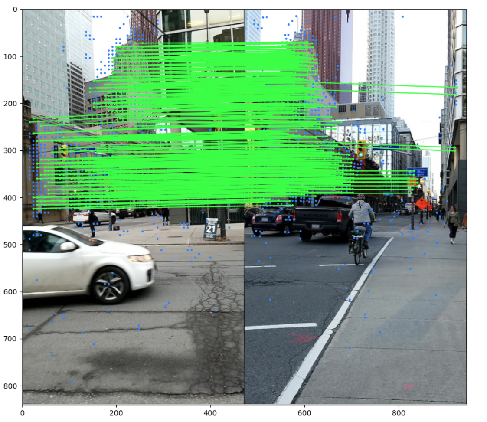
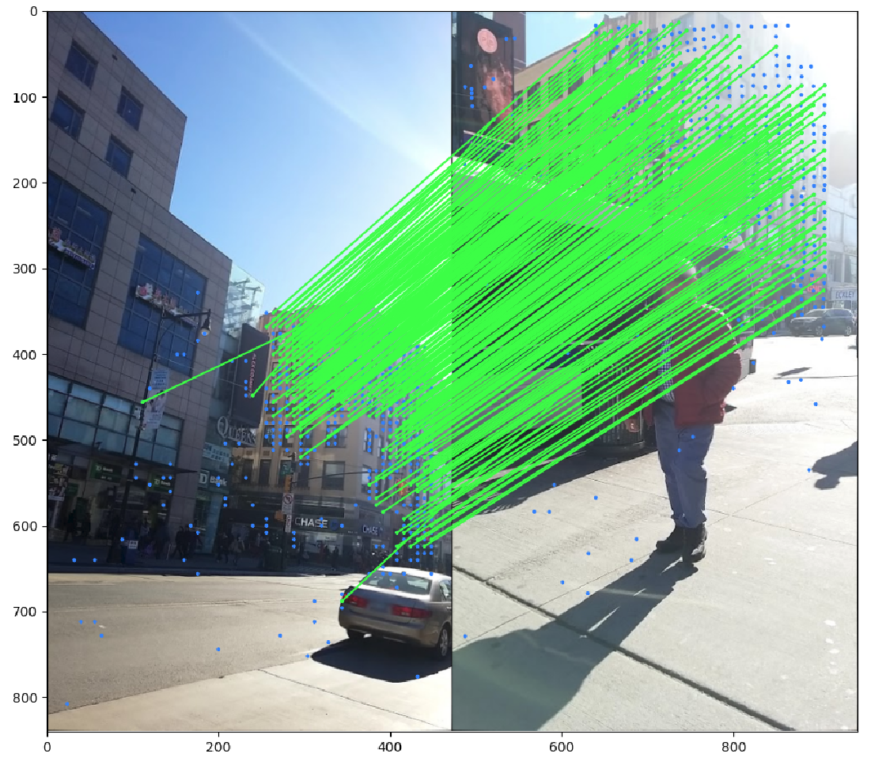
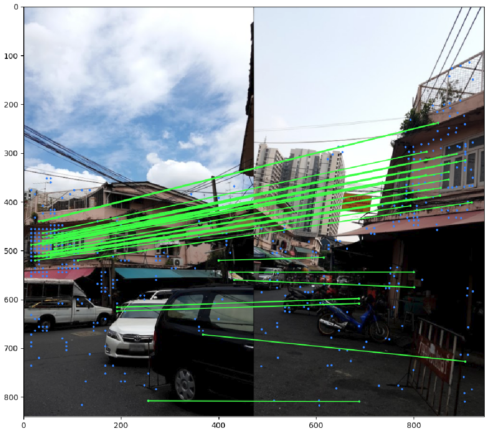

# Image Matching Challenge 2022

## Task

Creating a machine learning algorithm that registers two images from different viewpoints.

## Installation

```
git clone https://github.com/gunesevitan/image-matching-challenge-2022.git
cd anadolu-image-matching-challenge
virtualenv --python=/usr/bin/python3.9 venv
source venv/bin/activate
pip install -r requirements.txt
```

You can install dataset either manually from https://www.kaggle.com/competitions/image-matching-challenge-2022/data or using Kaggle API.
Ensure kaggle.json is in the location `~/.kaggle/kaggle.json` to use the API

```
pip install kaggle
cd data
kaggle competitions download image-matching-challenge-2022
unzip image-matching-challenge-2022.zip
```

## Project Structure

Dataset is inside data directory.

Data analysis and visualizations are inside eda directory.

Logs are inside logs directory

Pre-trained model weights and model configurations are inside models directory.

Papers and other resources are inside resources directory.

Source files are inside src directory.

```
image-matching-challenge-2022/
├─ data/
├─ eda/
├─ logs/
├─ models/
│  ├─ lfdd/
│  ├─ loftr/
│  ├─ matcher/
├─ resources/
├─ src/
├─ venv/
├─ .gitignore
├─ requirements.txt
├─ README.md
```

## Deep Local Feature Detector Descriptor Models

Deep local feature detector descriptor models are implemented in `lfdd.py`. They can be configured from `models/lfdd/config_lfdd.yaml`. They are combinations of orientation module -> affine module -> detector module -> descriptor module.

Available orientation modules are OriNet and PatchDominantGradientOrientation.

Available affine modules are LAFAffNetShapeEstimator.

Available detector modules are KeyNetDetector.

Available descriptor modules are HardNet8, HyNet, TFeat and SOSNet.

## LoFTR

LoFTR model is implemented in `loftr.py` and it can be configured from `models/loftr/config_loftr.yaml`.

Available pre-trained LoFTR model weights are indoor and outdoor.

## Fundamental Matrix

Fundamental matrix is estimated using RANSAC. OpenCV implementation of RANSAC is used in `solver.py` and it can be configured from `models/matcher/config_matcher.yaml` -> `solver_parameters`.

## Matching

Image matching can simply be done by running `matcher.py`.
Matcher module can be configured from `models/matcher/config_matcher.yaml`.

Matcher can be used in two modes; validation and test.

* Validation mode calculates mean Average Accuracy (mAA) of the selected scenes and sampled image pairs in training set.
* Test mode estimates fundamental matrix of image pairs in test set and writes them into `submission.csv` file.

Visualization can be set to True in order to visualize inlier keypoints detected on image pair.




